# Starknet Privacy

Privacy pool protocol for Starknet.

[](LICENSE)

Users submit private transfers through the SDK, which compiles client actions and sends them to an operator-side proving service. The proving service executes these actions in virtual Starknet blocks and returns a validity proof together with proof facts back to the SDK. The SDK builds a transaction that the wallet submits (ideally via a paymaster to avoid leaking sender info) to Starknet. Starknet verifies the proof and provides validated proof facts to the pool contract via syscall. A discovery service indexes encrypted on-chain storage so wallets can efficiently sync their notes without scanning the full chain.

## Architecture

```mermaid
graph LR
    subgraph Offchain
        Wallet([Wallet])
        SDK[SDK]
        Discovery[Discovery]
        Proving[Proving]
    end

    subgraph Onchain
        Contract[Privacy Pool]
        Helpers[Invoke Helpers]
    end

    Wallet --> SDK
    SDK --> Discovery
    SDK --> Proving
    SDK --> Contract
    Discovery --> Contract
    Proving --> Contract
    Contract --> Helpers
```



- **SDK** — Orchestrates private transfers (register, transfer, discover)
- **Discovery Service** — Indexes encrypted on-chain storage for efficient wallet sync
- **Proving Service** — Executes actions in virtual Starknet blocks and returns validity proofs + proof facts to the SDK
- **Privacy Pool Contract** — Source of truth for actions, storage layout, cryptography
- **Invoke Helpers** — External contracts callable from within a private transaction (e.g. swap executors)

## Compatibility matrix

All components in a row are tested together. Use matching revisions when deploying.

| Component | Docs | Image / Tag |
|-----------|------|-------------|
| Sequencer Gateway | | `ghcr.io/starkware-libs/sequencer/sequencer:APOLLO-0.14.2-RC.1` |
| Transaction Prover | [README](https://github.com/starkware-libs/sequencer/tree/avi/privacy/configmap-docs/crates/starknet_transaction_prover) | `us-central1-docker.pkg.dev/starkware-dev/sequencer/transaction-prover:PRIVACY-0.14.2-RC.1` |
| Discovery Service | [README](deploy/discovery-service/README.md) | `ghcr.io/starkware-libs/starknet-privacy/discovery-service:PRIVACY-0.14.2-RC.1` |
| Pathfinder* | [docs](https://eqlabs.github.io/pathfinder/getting-started/running-pathfinder) | `eqlabs/pathfinder:v0.22.0-beta.3` |
| SDK | [README](sdk/README.md) | [`PRIVACY-0.14.2-RC.1`](https://github.com/starkware-libs/starknet-privacy/tree/PRIVACY-0.14.2-RC.1) |

\* For the transaction prover to work correctly with Pathfinder, set `PATHFINDER_STORAGE_STATE_TRIES=10000`.

### Contracts

| Contract | Docs | Tag | Class Hash |
|----------|------|-----|------------|
| Privacy Pool | [README](packages/privacy/README.md) | [`PRIVACY-0.14.2-RC.1`](https://github.com/starkware-libs/starknet-privacy/tree/PRIVACY-0.14.2-RC.1) | `0x21a53b2cde0fbec5761793c09626fe6e53357d7856389711a8391d8468102e3` |
| Ekubo Helper | | | |
| Vesu Helper | [README](https://github.com/starkware-libs/starknet-privacy/tree/main/packages/vesu_lending_helper) | [`PRIVACY-0.14.2-RC.1`](https://github.com/starkware-libs/starknet-privacy/tree/PRIVACY-0.14.2-RC.1) | `0x1973a0ccabe1e1fc995bcac13c52300fc9953342293d3c15e878bdca84751a1` |

## Repository map

| Directory | Description |
|-----------|-------------|
| [`packages/privacy/`](packages/privacy/) | Cairo smart contract ([README](packages/privacy/README.md)) |
| [`crates/discovery-core/`](crates/discovery-core/) | Core discovery logic & cryptography ([README](crates/discovery-core/README.md)) |
| [`crates/discovery-service/`](crates/discovery-service/) | HTTP discovery service (RPC-backed) ([README](crates/discovery-service/README.md)) |
| [`sdk/`](sdk/) | TypeScript SDK for private transfers ([README](sdk/README.md)) |
| [`e2e/`](e2e/) | End-to-end tests & devnet fixture generation ([README](e2e/README.md)) |
| [`deploy/discovery-service/`](deploy/discovery-service/) | Dockerfile & deployment ([README](deploy/discovery-service/README.md)) |
| [`lean/`](lean/) | Formal verification (Lean) |
| [`demo/`](demo/) | Web demo application |
| [`scripts/`](scripts/) | Utility scripts (devnet, deployment, etc.) |
| [`docs/`](docs/) | Audit reports & security docs ([audit](docs/audit/README.md)) |
| [`crates/discovery-service/specs/`](crates/discovery-service/specs/) | Discovery service specifications ([README](crates/discovery-service/specs/README.md)) |

## Prerequisites

### Cairo

Install [Scarb](https://docs.swmansion.com/scarb/) and [Starknet Foundry](https://foundry-rs.github.io/starknet-foundry/index.html) via [starkup](https://github.com/software-mansion/starkup):

```bash
curl --proto '=https' --tlsv1.2 -sSf https://sh.starkup.dev | sh
```

### Rust

Stable toolchain. Install via [rustup](https://rustup.rs/) if needed.

### Node.js

Version 20 or later.

### E2E tests

See [e2e/README.md](e2e/README.md) for additional setup requirements (devnet, `.env` generation, built artifacts).

## Build and test

```bash
scarb build && scarb test          # Cairo contract
cargo build && cargo test          # Rust crates
cd sdk && npm ci && npm test       # TypeScript SDK
cd e2e && npm ci && npm test       # E2E
```

## License

[Apache 2.0](LICENSE)

## Audit

Find the latest audit report in [docs/audit](docs/audit).

## Security

For more information and to report security issues, please refer to the [security documentation](docs/SECURITY.md).
