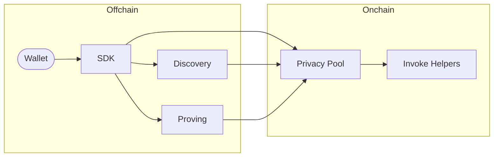

# Starknet Privacy

Privacy pool protocol for Starknet.

[](LICENSE)

Users submit private transfers through the SDK, which compiles client actions into a transaction. An operator-side proving service executes these transactions in virtual Starknet blocks, generates validity proofs, and submits them to Starknet for on-chain verification. A discovery service indexes encrypted on-chain storage so wallets can efficiently sync their notes without scanning the full chain.

## Architecture



- **SDK** — Orchestrates private transfers (register, transfer, discover)
- **Discovery Service** — Indexes encrypted on-chain storage for efficient wallet sync
- **Proving Service** — Proves virtual Starknet blocks and submits validity proofs on-chain
- **Privacy Pool Contract** — Source of truth for actions, storage layout, cryptography
- **Invoke Helpers** — External contracts callable from within a private transaction (e.g. swap executors)

## Repository map

```
starknet-privacy/
├── packages/privacy/     Cairo smart contract (Scarb workspace)
├── crates/
│   ├── discovery-core/   Core discovery logic & cryptography (Rust library)
│   └── discovery-service/ HTTP indexing service with SQLite cache (Rust binary)
├── sdk/                  TypeScript SDK for private transfers
├── e2e/                  End-to-end tests & devnet fixture generation
├── lean/                 Formal verification (Lean)
├── demo/                 Web demo application
├── docs/                 Audit reports & security docs
└── .claude/
    ├── CLAUDE.md         Project-level agent instructions
    ├── rules/            Code style, testing, verification rules
    └── specs/            Discovery service specifications
```

Each component directory contains its own README with architecture details, API docs, and build instructions.

## Prerequisites

### Cairo

Install [Scarb](https://docs.swmansion.com/scarb/) and [Starknet Foundry](https://foundry-rs.github.io/starknet-foundry/index.html) via [starkup](https://github.com/software-mansion/starkup):

```bash
curl --proto '=https' --tlsv1.2 -sSf https://sh.starkup.dev | sh
```

### Rust

Stable toolchain. Install via [rustup](https://rustup.rs/) if needed.

### Node.js

Version 18 or later.

### Starknet Devnet

This project uses a [custom fork of starknet-devnet](https://github.com/m-kus/starknet-devnet) that includes a blockifier version supporting the new transaction version with proofs. Install from the `APOLLO-PRE-PROOF-DEMO-11` release:

If you have a previous asdf installation of starknet-devnet, remove it first:

```bash
asdf plugin remove starknet-devnet
```

Then install from the release:

```bash
# macOS (Apple Silicon)
curl -L https://github.com/m-kus/starknet-devnet/releases/download/APOLLO-PRE-PROOF-DEMO-11/starknet-devnet-aarch64-apple-darwin.tar.gz -o /tmp/starknet-devnet.tar.gz
sudo tar -xzf /tmp/starknet-devnet.tar.gz -C /usr/local/bin
sudo chmod +x /usr/local/bin/starknet-devnet
rm /tmp/starknet-devnet.tar.gz

# Linux (x86_64)
curl -L https://github.com/m-kus/starknet-devnet/releases/download/APOLLO-PRE-PROOF-DEMO-11/starknet-devnet-x86_64-unknown-linux-gnu.tar.gz -o /tmp/starknet-devnet.tar.gz
sudo tar -xzf /tmp/starknet-devnet.tar.gz -C /usr/local/bin
sudo chmod +x /usr/local/bin/starknet-devnet
rm /tmp/starknet-devnet.tar.gz
```

Verify the installation:

```bash
which starknet-devnet
# Expected: /usr/local/bin/starknet-devnet
```

## Build and test

```bash
scarb build && scarb test          # Cairo contract
cargo build && cargo test          # Rust crates
cd sdk && npm ci && npm test       # TypeScript SDK
cd e2e && npm ci && npm test       # E2E (requires devnet + built artifacts)
```

## License

[Apache 2.0](LICENSE)

## Audit

Find the latest audit report in [docs/audit](docs/audit).

## Security

For more information and to report security issues, please refer to the [security documentation](docs/SECURITY.md).
