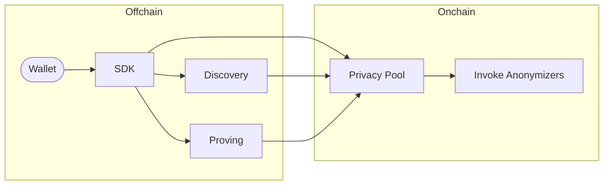

# Starknet Privacy

This repository contains the protocol implementation behind [STRK20](https://strk20.starknet.io/), the privacy pool developed by StarkWare for ERC-20 assets on Starknet. It includes Cairo contracts, a TypeScript SDK, discovery services and a Lean formal model.

STRK20 uses STARK proofs generated with Stwo to verify private transfers that settle on Starknet. Users choose when to shield assets in the pool. The underlying Starknet blockchain remains public.

[](LICENSE)

## Build with STRK20

Choose the integration route for your project:

| You are building | Integration route | Start here |
| --- | --- | --- |
| A private dapp using an existing wallet | Starknet Wallet API through starknet.js. The wallet manages viewing keys, notes and proof generation. | [WalletAccount guide](https://starknet-js.com/docs/guides/account/walletAccount/#strk20-privacy-protocol) and [Wallet API examples](https://strk20-by-example.org/starknet-wallet-api/overview) |
| A privacy wallet or backend that manages private state | The TypeScript Privacy SDK in this repository, for direct control over keys, note discovery and proving. | [SDK guide](sdk/README.md) and [SDK examples](https://strk20-by-example.org/sdk/getting-started) |

Core STRK20 Wallet API methods first shipped in [starknet.js 10.4.0](https://github.com/starknet-io/starknet.js/releases/tag/v10.4.0). The current WalletAccountV6 guide requires get-starknet 6.0.2 or later. Check the guide for your starknet.js version and the actions available in the connected wallet. For SDK integrations, use the component revisions in the [compatibility matrix](#compatibility-matrix) and the [SDK prerequisites](sdk/README.md#prerequisites).

The [STRK20 builder hub](https://strk20.starknet.io/build) brings together integration routes and starter kits. For app-specific DeFi interactions, see the [Cairo anonymizer contract guide](https://strk20-by-example.org/helpers/privacy-invoke).

## Capabilities and verification

- [Protocol documentation](https://docs.starknet.io/build/starknet-privacy/overview) covers capabilities and deployment information. The [privacy limits](https://docs.starknet.io/build/starknet-privacy/security) explain public deposit and withdrawal data and what external app interactions can reveal.
- [Formal verification](https://starkware.co/blog/strk20-formal-verification/) describes the protocol-model properties proved in Lean. The [Lean source](lean/) is included in this repository.
- [Implementation audits](docs/audit/README.md) list the reviewed components, commits and reports. Their scope is separate from the Lean protocol-model proofs.

## How private transfers are processed

Users submit private transfers through the SDK, which compiles client actions and sends them to an operator-side proving service. The proving service executes these actions in virtual Starknet blocks and returns a validity proof together with proof facts back to the SDK. The SDK builds a transaction that the wallet submits (ideally via a paymaster to avoid leaking sender info) to Starknet. Starknet verifies the proof and provides validated proof facts to the pool contract via syscall. A discovery service indexes encrypted on-chain storage so wallets can efficiently sync their notes without scanning the full chain.

## Architecture


```mermaid
graph LR
    subgraph Offchain
        Wallet([Wallet])
        SDK[SDK]
        Discovery[Discovery]
        Proving[Proving]
    end

    subgraph Onchain
        Contract[Privacy Pool]
        Anonymizers[Invoke Anonymizers]
    end

    Wallet --> SDK
    SDK --> Discovery
    SDK --> Proving
    SDK --> Contract
    Discovery --> Contract
    Proving --> Contract
    Contract --> Anonymizers
```

- **SDK** — Orchestrates private transfers (register, transfer, discover)
- **Discovery Service** — Indexes encrypted on-chain storage for efficient wallet sync
- **Proving Service** — Executes actions in virtual Starknet blocks and returns validity proofs + proof facts to the SDK
- **Privacy Pool Contract** — Source of truth for actions, storage layout, cryptography
- **Invoke Anonymizers** — External contracts callable from within a private transaction (e.g. swap executors)

## Compatibility matrix

All components in a row are tested together. Use matching revisions when deploying.

| Component          | Docs                                                                                                                     | Tag                                                                                                                                                                                                          |
| ------------------ | ------------------------------------------------------------------------------------------------------------------------ | ------------------------------------------------------------------------------------------------------------------------------------------------------------------------------------------------------------ |
| Transaction Prover | [README](https://github.com/starkware-libs/sequencer/tree/avi/privacy/configmap-docs/crates/starknet_transaction_prover) | [`ghcr.io/starkware-libs/starknet-privacy/transaction-prover:PRIVACY-0.14.3-RC.2`](https://github.com/starkware-libs/sequencer/pkgs/container/starknet-privacy%2Ftransaction-prover?tag=PRIVACY-0.14.3-RC.2) |
| Proof Interceptor† | [README](proof-interceptor/README.md)                                                                                    | [`ghcr.io/starkware-libs/starknet-privacy/proof-interceptor:PRIVACY-0.14.3-RC.7`](https://github.com/starkware-libs/starknet-privacy/pkgs/container/starknet-privacy%2Fproof-interceptor)                    |
| Discovery Service  | [README](deploy/discovery-service/README.md)                                                                             | [`ghcr.io/starkware-libs/starknet-privacy/discovery-service:PRIVACY-0.14.3-RC.8`](https://github.com/starkware-libs/starknet-privacy/pkgs/container/starknet-privacy%2Fdiscovery-service)                    |
| Pathfinder\*       | [docs](https://eqlabs.github.io/pathfinder/getting-started/running-pathfinder)                                           | [`eqlabs/pathfinder:v0.22.7`](https://hub.docker.com/layers/eqlabs/pathfinder/v0.22.7/images/sha256-443ba8749c501f0dc5d8c8fbf03805ab7f3e9fc8ca8948f2e680005599a7f6a0)                                        |
| SDK                | [README](sdk/README.md)                                                                                                  | [`PRIVACY-0.14.3-RC.8`](https://github.com/starkware-libs/starknet-privacy/tree/PRIVACY-0.14.3-RC.8)                                                                                                         |

\* For the transaction prover to work correctly with Pathfinder, set `PATHFINDER_STORAGE_STATE_TRIES=10000`.

† Optional deposit-screening sidecar to the transaction prover; deploy only for screening-enabled pools.

## Repository map

| Directory                                                            | Description                                                                           |
| -------------------------------------------------------------------- | ------------------------------------------------------------------------------------- |
| [`packages/privacy/`](packages/privacy/)                             | Cairo smart contract ([README](packages/privacy/README.md))                           |
| [`crates/discovery-core/`](crates/discovery-core/)                   | Core discovery logic & cryptography ([README](crates/discovery-core/README.md))       |
| [`crates/discovery-service/`](crates/discovery-service/)             | HTTP discovery service (RPC-backed) ([README](crates/discovery-service/README.md))    |
| [`sdk/`](sdk/)                                                       | TypeScript SDK for private transfers ([README](sdk/README.md))                        |
| [`e2e/`](e2e/)                                                       | End-to-end tests & devnet fixture generation ([README](e2e/README.md))                |
| [`deploy/discovery-service/`](deploy/discovery-service/)             | Dockerfile & deployment ([README](deploy/discovery-service/README.md))                |
| [`lean/`](lean/)                                                     | Formal verification (Lean)                                                            |
| [`demo/`](demo/)                                                     | Web demo application                                                                  |
| [`scripts/`](scripts/)                                               | Utility scripts (devnet, deployment, etc.)                                            |
| [`docs/`](docs/)                                                     | Audit reports & security docs ([audit](docs/audit/README.md))                         |
| [`crates/discovery-service/specs/`](crates/discovery-service/specs/) | Discovery service specifications ([README](crates/discovery-service/specs/README.md)) |

## Prerequisites

### Cairo

Install [Scarb](https://docs.swmansion.com/scarb/) and [Starknet Foundry](https://foundry-rs.github.io/starknet-foundry/index.html) via [starkup](https://github.com/software-mansion/starkup):

```bash
curl --proto '=https' --tlsv1.2 -sSf https://sh.starkup.dev | sh
```

### Rust

Stable toolchain. Install via [rustup](https://rustup.rs/) if needed.

### Node.js

The TypeScript SDK requires Node.js 24 or later. See the [SDK prerequisites](sdk/README.md#prerequisites).

### E2E tests

See [e2e/README.md](e2e/README.md) for additional setup requirements (devnet, `.env` generation, built artifacts).

## Build and test

```bash
scarb build && scarb test          # Cairo contract
cargo build && cargo test          # Rust crates
cd sdk && npm ci && npm test       # TypeScript SDK
cd e2e && npm ci && npm test       # E2E
```

## License

[Apache 2.0](LICENSE)

## Audit

Find the latest audit report in [docs/audit](docs/audit).

## Security

For more information and to report security issues, please refer to the [security documentation](docs/SECURITY.md).
