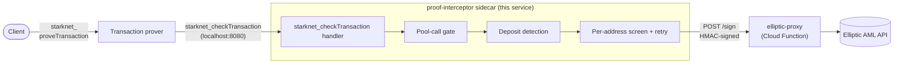

# proof-interceptor

JSON-RPC service that screens privacy-pool deposit transactions against OFAC sanctions before the transaction prover produces a proof. It sits alongside the prover as an in-pod sidecar and is called by the prover, not by end clients.

The prover stays the public entry point of the system; client APIs do not change. Screening is invisible from the outside — when a transaction is allowed the client gets a proof as usual, when it is blocked the client gets JSON-RPC error code `10000` ("Transaction rejected").

> **Production policy at a glance:** fail-closed at both layers (defaults), `SCREENING_BLOCK_NON_POOL_TX=true`, listener binding chosen deliberately (prefer `HOST=127.0.0.1` unless direct Prometheus scraping requires `HOST=0.0.0.0` plus a NetworkPolicy restricting ingress to the prover and the approved scraper), `SCREENING_URL` set, SDK pinned to match the deployed pool contract. The shipped defaults are biased toward "don't break unrelated transaction flows" rather than "be a strict compliance gate"; production must opt into the strict path.

## Where it fits

<div align="center">



</div>

The prover runs the screening round-trip in parallel with proving. The sidecar receives one `starknet_checkTransaction` per client `starknet_proveTransaction`, decodes the deposit action span using `PrivacyPoolABI` from `@starkware-libs/starknet-privacy-sdk`, and screens `user_addr` via HMAC-signed `POST /sign` to elliptic-proxy. The `/sign` call screens **and**, on allow, returns a STARK-curve signature over the depositor address; the sidecar relays that signature on the `checkTransaction` allow response, and the prover attaches it under `additional_data.signature` for the SDK to pack into the deposit's `apply_actions` calldata. This service is stateless. The HMAC scheme (SHA-256 over `timestamp || method || path.toLowerCase() || body`, base64-decoded partner secret as the key) lives in `src/screening-interceptor.ts:computeHmacSignature` — use that as the reference if you need to verify partner credentials independently.

## What gets screened

| Category                      | Verdict                                             | When                                                                                                                                                                                                                                                                  |
| ----------------------------- | --------------------------------------------------- | --------------------------------------------------------------------------------------------------------------------------------------------------------------------------------------------------------------------------------------------------------------------- |
| **Screened**                  | depends on Elliptic                                 | Single direct INVOKE-v3 to `SCREENING_POOL_ADDRESS` carrying a Deposit action. The depositor address (`user_addr`, `inner_calldata[0]`) is sent to elliptic-proxy.                                                                                                    |
| **Bypass (non-pool)**         | `allow`                                             | Multi-call INVOKEs, calls to contracts other than `SCREENING_POOL_ADDRESS`, and pool calls whose `calldata[0]`/address is non-canonically encoded (`"0x01"`, `"0X1"`, case-mismatched address). Set `SCREENING_BLOCK_NON_POOL_TX=true` to block all of these instead. |
| **Bypass (pool, no Deposit)** | `allow`                                             | Pool calls with no Deposit action (withdraw-only) or whose action span fails to decode (most often ABI drift). **Not affected by `SCREENING_BLOCK_NON_POOL_TX`** — this toggle only changes the non-pool branch.                                                      |
| **Blocked**                   | RPC error `10000`                                   | Sanctioned `user_addr`, screening-pipeline failure with fail-closed defaults, or any unhandled exception inside an interceptor (caught and converted to a block with the exception message as the reason).                                                            |
| **Inconclusive**              | RPC error other than `10000`, or no response at all | Envelope rejection (e.g. RPC error `61` "Unsupported tx version"), network error talking to the sidecar, timeout, or any non-`10000` RPC error. The prover decides what to do via its `blocking_check_fail_open` setting.                                             |

## Production safety checklist

Defaults are deployment-friendly, not security-strict. Apply these for production:

- **`SCREENING_BLOCK_NON_POOL_TX=true`** — converts the multi-call bypass and the non-canonical-felt bypass into blocks. The single most important toggle.
- **`SCREENING_FAIL_OPEN=false`** and **prover-side `blocking_check_fail_open=false`** — both default false; verify in deployment.
- **Choose listener binding deliberately.** The service has no application-level authentication, so the host binding is the security boundary. Prefer `HOST=127.0.0.1` (loopback-only, in-pod sidecar) when metrics can be relayed by the prover or a co-located collector. Use `HOST=0.0.0.0` only when direct Prometheus scraping of the Pod IP is required, and pair it with a NetworkPolicy restricting ingress to the prover and the approved scraper. Co-location in the same Pod is _not_ by itself the boundary: with `HOST=0.0.0.0`, the listener is reachable from any Pod that can route to this Pod's IP.
- **`TLS_CERT_PATH`/`TLS_KEY_PATH` are server-side TLS only.** They encrypt the prover↔sidecar connection but do _not_ authenticate the client (no `requestCert`/`ca` is configured in `src/server.ts`). For real mTLS, put a service mesh or proxy in front of the sidecar.
- **Verify `SCREENING_URL` is set.** Without it, the service runs as a no-op pass-through that always returns `allowed: true` — `/health` still reports OK. Confirm `proof_interceptor_screening_results_total` is non-zero on `/metrics`.
- **Pin `@starkware-libs/starknet-privacy-sdk`** to a version whose `PrivacyPoolABI` matches the deployed pool contract. ABI drift causes silent fail-open on Deposit detection.

## Configuration

Required when screening is enabled (the production case):

| Env var                    | Purpose                                                                                                                                                 |
| -------------------------- | ------------------------------------------------------------------------------------------------------------------------------------------------------- |
| `SCREENING_URL`            | Base URL of the elliptic-proxy. Setting this is what enables screening — leaving it unset is the silent-pass-through hazard.                            |
| `SCREENING_PARTNER_NAME`   | Partner identifier issued by the proxy operator.                                                                                                        |
| `SCREENING_PARTNER_SECRET` | Base64-encoded HMAC key issued by the proxy operator.                                                                                                   |
| `SCREENING_POOL_ADDRESS`   | Privacy-pool contract address — only direct calls to this address are screened.                                                                         |
| `SCREENING_CHAIN_ID`       | chain_id (felt hex) of the deployed network. Sent to `/sign` and bound into the signed digest; must match what the contract derives from `get_tx_info`. |

Plus the production toggle `SCREENING_BLOCK_NON_POOL_TX=true` discussed above. Optional knobs (`SCREENING_TIMEOUT_MS`, `SCREENING_TOTAL_TIMEOUT_MS`, `SCREENING_MAX_RETRIES`, `SCREENING_FAIL_OPEN`, `PORT`, `HOST`, `MAX_BODY_BYTES`, `TLS_CERT_PATH`/`TLS_KEY_PATH`) and their defaults are in `src/config.ts`. Note: `SCREENING_FAIL_OPEN` does **not** apply to the screening-v2 signing path — a deposit without a signature cannot proceed on-chain, so a signing failure always fails closed.

## HTTP endpoints

| Path       | Method | Description                                                                                                           |
| ---------- | ------ | --------------------------------------------------------------------------------------------------------------------- |
| `/`        | POST   | JSON-RPC entrypoint. Only `starknet_checkTransaction` is accepted; everything else returns `-32601 Method not found`. |
| `/health`  | GET    | Liveness/readiness. Returns `200 {"status":"ok"}`.                                                                    |
| `/metrics` | GET    | Prometheus metrics.                                                                                                   |

### Request

The body mirrors `starknet_proveTransaction` exactly (object or positional params). The screened shape is a single direct INVOKE-v3 to `SCREENING_POOL_ADDRESS` with `calldata = [call_count=1, contract_address=pool, selector, inner_len, user_addr, user_private_key, ...action_span]`. The action span is decoded against `PrivacyPoolABI`; only the Deposit variant triggers a screen. See `src/rpc.ts` for envelope validation and the calldata-layout comments above `isSinglePoolCall` in `src/screening-interceptor.ts` for the field-by-field breakdown.

### Response shapes

```json
// allow, non-deposit / bypass case (no attestation needed)
{ "jsonrpc": "2.0", "id": 1, "result": { "allowed": true } }

// allow, screened deposit — carries the signature to relay to the prover
// (the prover attaches it under additional_data.signature on the prove response)
{ "jsonrpc": "2.0", "id": 1,
  "result": { "allowed": true,
              "signature": { "signature_timestamp": 1716579600,
                             "sig_r": "0x...", "sig_s": "0x..." } } }

// block — sanction match. Reason is an opaque code (never the depositor address).
{ "jsonrpc": "2.0", "id": 1,
  "error": { "code": 10000, "message": "Transaction rejected",
             "data": "address_blocked" } }

// block — screening/signing unavailable (fail-closed)
{ "jsonrpc": "2.0", "id": 1,
  "error": { "code": 10000, "message": "Transaction rejected",
             "data": "screening_unavailable" } }

// envelope rejection — prover treats as inconclusive, not a block
{ "jsonrpc": "2.0", "id": 1,
  "error": { "code": 61, "message": "Unsupported tx version",
             "data": "Only version 0x3 is supported, got: 0x1" } }
```

## Security boundaries

- **Silent pass-through.** Missing `SCREENING_URL` makes the service a no-op that returns `allowed: true` for every transaction; `/health` is unchanged. The worst possible failure mode for a screening gate. Verify on every deploy that `proof_interceptor_screening_results_total != 0` and a known-sanctioned address returns code `10000`.
- **Unauthenticated listener.** No API key, no mTLS, no application-level ACL. Anything that can route to the listener becomes a free screening oracle for Elliptic's blocklist and can burn your partner-secret quota. Mitigations live entirely in network layout: `HOST=127.0.0.1` (loopback, in-pod sidecar), or `HOST=0.0.0.0` paired with a NetworkPolicy that allows ingress only from the prover and the approved Prometheus scraper. Do not expose this service via Service/Ingress without that NetworkPolicy.
- **Non-canonical felt encodings.** The pool-call gate is sensitive to how `calldata[0]` and the contract address are encoded. `"0x01"`, `"0X1"`, and case-mismatched addresses all classify a real pool call as non-pool and bypass screening when `SCREENING_BLOCK_NON_POOL_TX=false`. Set it to `true` for production so non-canonical pool calls become blocks instead of silent passes.
- **`user_addr` is the only screened address.** `sender_address`, token addresses, withdrawal recipients, and addresses inside other calls are not screened. The compliance correctness of this service rests on the contract's invariant that deposits debit `user_addr`'s balance. Review pool-contract deposit semantics whenever they change.
- **ABI drift.** Pool-contract upgrades that aren't reflected in the SDK pin cause `hasDepositAction` to silently `catch` and return `false` — every Deposit during the mismatch window is allowed without screening. Bump `@starkware-libs/starknet-privacy-sdk` in lock-step with pool-contract upgrades; consider a CI check that decodes a known-good Deposit fixture against the SDK on every deploy.
- **Fail-open layering.** Two independent fail-open knobs: `SCREENING_FAIL_OPEN` here (default false; blocks when this service can't reach the proxy), and `blocking_check_fail_open` in the prover's `config.json` (default false; covers the case where the prover can't reach this service at all). Both default fail-closed. Fail-open allowances increment the same `result="allowed"` counter as real allows; the only signal is the `screening_failed` log line.

## Metrics

Prometheus counters/histograms exported on `/metrics` (defined in `src/metrics.ts`):

- `proof_interceptor_screening_results_total{result}` — `allowed` / `blocked` / `unavailable`. The primary signal that screening is wired up at all.
- `proof_interceptor_screening_retries_total` — retry attempts only (first attempts excluded).
- `proof_interceptor_screening_duration_seconds{result}` — Elliptic round-trip latency.
- `proof_interceptor_interceptor_verdicts_total{interceptor,verdict}` — per-interceptor verdicts.
- `proof_interceptor_rpc_requests_total{action,method}` and `proof_interceptor_errors_total{type}` — request and error counters.

Plus default Node.js process metrics from `prom-client`.

## Verifying a deployment

```bash
# liveness
curl -fsS http://<pod>:8080/health    # → {"status":"ok"}

# screening is actually exercised (the only check that catches silent pass-through)
curl http://<pod>:8080/metrics | grep proof_interceptor_screening_results_total
```

If `proof_interceptor_screening_results_total` stays at zero after real traffic, `SCREENING_URL` is probably unset.

## Development

```bash
npm ci
npm run build       # tsc → dist/
npm test            # vitest run
npm run lint        # prettier + eslint + tsc --noEmit
npm run format      # auto-fix
```

Run locally without screening (no-op pass-through, intended for testing the request-handling path only):

```bash
PORT=8080 npm start
```

Run locally with screening pointed at a real elliptic-proxy:

```bash
SCREENING_URL=https://<proxy-host> \
SCREENING_PARTNER_NAME=<partner-name> \
SCREENING_PARTNER_SECRET=<base64-secret> \
SCREENING_POOL_ADDRESS=0x... \
PORT=8080 \
npm start
```

## Source map

| File                           | Responsibility                                                                                           |
| ------------------------------ | -------------------------------------------------------------------------------------------------------- |
| `src/index.ts`                 | Entry point — loads config, builds the handler, starts the server, wires graceful shutdown               |
| `src/config.ts`                | Environment-variable parsing and validation                                                              |
| `src/server.ts`                | HTTP/HTTPS server bootstrap                                                                              |
| `src/proxy.ts`                 | Top-level request handler — routing (`/`, `/health`, `/metrics`), body limits, JSON-RPC error mapping    |
| `src/rpc.ts`                   | JSON-RPC envelope and `starknet_checkTransaction` parameter validation                                   |
| `src/interceptor.ts`           | Parallel interceptor runner with first-block-wins semantics                                              |
| `src/screening-interceptor.ts` | Pool-call gate, deposit detection, address extraction, retry/timeout, HMAC-signed call to elliptic-proxy |
| `src/types.ts`                 | JSON-RPC and `ProveTxnV3` types                                                                          |
| `src/metrics.ts`               | Prometheus registry and metric definitions                                                               |
| `src/shutdown.ts`              | SIGTERM/SIGINT handlers                                                                                  |
| `tests/`                       | Vitest unit and end-to-end tests                                                                         |
