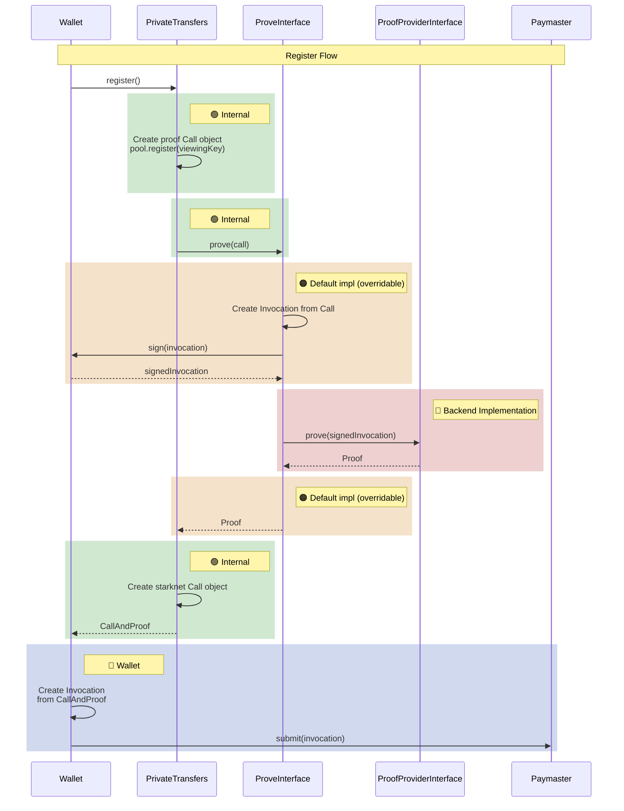
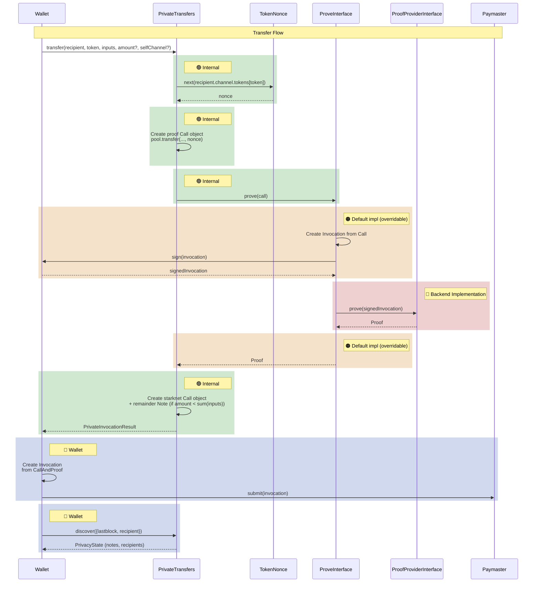

# Privacy SDK

TypeScript SDK for private transfers on Starknet.

## Publishing

To publish a release:

1. Bump `version` in `package.json` to the desired release version
2. Authenticate with GitHub Packages:
   ```sh
   echo "//npm.pkg.github.com/:_authToken=YOUR_GITHUB_TOKEN" >> ~/.npmrc
   ```
3. Build and publish:
   ```sh
   cd sdk
   npm ci
   npm run generate
   npm run build
   npm publish
   ```

## Development

```bash
npm run lint      # check formatting (prettier), lints (eslint), and types (tsc)
npm run format    # auto-fix formatting and lint issues
npm run test      # run all tests
npm run test:fast # run tests excluding devnet
```

## Installation

From a tagged release (GitHub npm registry):

```bash
npm install @starkware-libs/starknet-privacy-sdk
```

From a specific commit (git):

```bash
npm install "starkware-libs/starknet-privacy#<commit-sha>"
```

## Quick start

```typescript
import { Account, RpcProvider } from "starknet";
import { createPrivateTransfers, IndexerDiscoveryProvider } from "starknet-sdk";

const provider = new RpcProvider({ nodeUrl: "http://localhost:5050" });
const account = new Account(provider, accountAddress, privateKey);

const transfers = createPrivateTransfers({
  account,
  viewingKeyProvider: { getViewingKey: () => viewingKey },
  provingProvider,
  discoveryProvider: new IndexerDiscoveryProvider(discoveryUrl, poolContractAddress),
  poolContractAddress,
});
```

## Configuration

### `createPrivateTransfers(params)`

| Parameter | Type | Description |
|-----------|------|-------------|
| `account` | `Account` | Starknet account for signing transactions |
| `viewingKeyProvider` | `ViewingKeyProvider` | Provides the private viewing key used for encryption/decryption |
| `provingProvider` | `ProofProviderInterface` | Backend that generates validity proofs |
| `discoveryProvider` | `DiscoveryProviderInterface` | Backend for discovering notes and channels |
| `poolContractAddress` | `StarknetAddress` | Address of the deployed privacy pool contract |
| `proofInvocationFactory?` | `ProofInvocationFactoryInterface` | Optional override for proof invocation construction |

### Discovery providers

**`ContractDiscoveryProvider`** — Queries the privacy pool contract directly via Starknet RPC. Best for development and testing.

```typescript
new ContractDiscoveryProvider(poolContract, { rateLimit?: { maxConcurrent, minDelay } });
```

**`IndexerDiscoveryProvider`** — Queries a discovery service via HTTP. Recommended for production; handles pagination and reorg detection.

```typescript
new IndexerDiscoveryProvider(apiUrl, contractAddress);
```

## Builder API

The builder provides a fluent interface for composing private operations. This is the recommended way to use the SDK.

### Register

```typescript
const result = await transfers.build()
  .register()
  .execute();
```

### Deposit

When depositing followed by other actions (transfers, withdrawals), omit the `recipient` on the deposit and use `surplusTo` to direct the remainder. This lets the SDK resolve all intermediate steps automatically.

```typescript
// Deposit to self (simple case)
const result = await transfers.build()
  .with(STRK, (t) => t.deposit({ amount: 100n }))
  .surplusTo(self)
  .execute();
```

### Deposit and transfer

```typescript
// Deposit 100, transfer 60 to bob — the SDK creates a 40 change note for self
const result = await transfers.build()
  .with(STRK, (t) => t
    .deposit({ amount: 100n })
    .transfer({ recipient: bob, amount: 60n }))
  .surplusTo(self)
  .execute();
```

### Transfer

```typescript
const result = await transfers.build()
  .with(STRK, (t) => t
    .inputs(note)
    .transfer({ recipient: bob, amount: 50n }))
  .execute();
```

### Withdraw

```typescript
const result = await transfers.build()
  .with(STRK, (t) => t
    .inputs(note)
    .withdraw({ amount: 30n }))
  .surplusTo(self)
  .execute();
```

### Multi-operation batch

```typescript
const result = await transfers.build()
  .with(STRK, (t) => t
    .inputs(note100Strk)
    .transfer({ recipient: alice, amount: 40n })
    .withdraw({ amount: 30n }))
  .surplusTo(self)
  .execute();
```

### Setup (open channel/subchannel)

```typescript
const result = await transfers.build()
  .setup(recipientAddress)
  .with(STRK, (t) => t.setup(recipientAddress))
  .execute();
```

`setup(recipient)` on the main builder opens a channel to the recipient. `setup(recipient)` on the token builder opens a token subchannel within that channel.

### Invoke external contract

```typescript
const result = await transfers.build()
  .with(STRK, (t) => t
    .inputs(strkNote)
    .withdraw({ recipient: swapHelper, amount: 10n }))
  .with(BTC, (t) => t
    .deposit({ amount: Open, depositor: swapHelper }))
  .invoke({ contractAddress: swapHelper, entrypoint: "swap", calldata: [...] })
  .execute();
```

`invoke(callDetails)` adds an external contract call to the transaction. At most one `invoke()` per transaction.

## Execute options

Pass options to `build()` or `execute()` to control automation:

```typescript
const result = await transfers.build({
  autoRegister: true,
  autoSetup: true,
  autoSelectNotes: "naive",
  autoDiscover: { notes: "refresh", channels: "refresh" },
  registry: myRegistry,
}).with(STRK, (t) => t
  .transfer({ recipient: bob, amount: 50n }))
  .execute();
```

| Option | Type | Description |
|--------|------|-------------|
| `autoRegister` | `boolean` | Automatically register if user has no viewing key on-chain |
| `autoSetup` | `boolean` | Automatically open channels and token subchannels as needed |
| `autoSelectNotes` | `"all" \| "naive"` | Automatically select input notes (`"all"` uses every note, `"naive"` selects minimum) |
| `autoDiscover` | `{ notes?, channels? }` | Refresh notes/channels before executing (`"missing"`, `"refresh"`, or `"all"`) |
| `registry` | `PrivateRegistry` | User's private state (notes, discovery cursors) |
| `registryConst` | `boolean` | If true, returns a new registry instead of mutating the provided one |
| `provingBlockId` | `ProvingBlockId` | Block identifier to use for proving |

## Registry management

The `PrivateRegistry` holds the user's private state: unspent notes and discovery cursors. Create one with `createEmptyRegistry()` and pass it through `ExecuteOptions`.

```typescript
import { createEmptyRegistry } from "starknet-sdk";

const registry = createEmptyRegistry();

// The registry is updated in-place after each execute()
const result = await transfers.build({
  registry,
  autoDiscover: { notes: "refresh", channels: "refresh" },
  autoSetup: true,
  autoSelectNotes: "naive",
}).with(STRK, (t) => t
  .deposit({ amount: 100n }))
.surplusTo(self)
.execute();

// result.registry === registry (same object, mutated)
// Use registryConst: true to get a new object instead
```

The registry contains:
- **`notes`** — `AddressMap<Note[]>`: unspent notes keyed by token address
- **`notesCursor`** — pagination cursor for incoming notes discovery (incremental sync)
- **`channelCursor`** — pagination cursor for outgoing channels discovery (incremental sync, includes `blockId` for reorg detection)

Discovery cursors are internal to the registry flow. When `autoDiscover` is set, the SDK uses them automatically for incremental syncing. You don't need to manage them directly.

**Optimistic updates:** After `execute()`, the registry is updated optimistically — spent notes are removed and new notes/channels are added before the transaction is confirmed on-chain. If the transaction reverts, the registry becomes stale. Handle this by re-discovering from scratch (`autoDiscover: "refresh"`) or by snapshotting the registry before `execute()` (use `registryConst: true`) and restoring on revert.

## Discovery

### Check transfer readiness

```typescript
const requirement = await transfers.discoverRequirement(recipient, token);
// Returns: SetupRequirement.Register | SetupChannel | SetupToken | Ready
```

### Discover notes

```typescript
const { notes, timestamp } = await transfers.discoverNotes({
  tokens: [STRK],
});
// notes: AddressMap<Note[]> — unspent notes keyed by token address
```

### Discover channels

```typescript
const { timestamp, channels, total } = await transfers.discoverChannels("all");
// channels: AddressMap<Channel> — channels keyed by recipient address
```

## Execute result

Every `execute()` call returns:

```typescript
type ExecuteResult = {
  callAndProof: CallAndProof;  // Call + proof to send to the contract's execute_actions entry point
  registry: PrivateRegistry;   // Updated notes and recipient info
  warnings: Warning[];         // Privacy leakage warnings
};
```

The wallet sends `callAndProof` in a transaction to the contract's `execute_actions` entry point. The returned `registry` can be reused in subsequent calls once the transaction is accepted and enough blocks have passed to make the state verifiable.

## Key types

**`Note`** — A private UTXO with an amount, token, and cryptographic witness.

**`Channel`** — A communication channel to a recipient, holding a shared key and per-token nonces.

**`PrivateRegistry`** — The user's local state: unspent notes and discovery cursors for incremental sync. Create with `createEmptyRegistry()`.

**`AddressMap<V>`** — A `Map` that normalizes Starknet addresses for consistent key lookup.

**`CallAndProof`** — A call + proof pair to send to the contract's `execute_actions` entry point.

**`Witness`** — Cryptographic witness for a note, used when spending.

**`SetupRequirement`** — Enum indicating what setup is needed before transferring: `Register`, `SetupChannel`, `SetupToken`, or `Ready`.

**`ExecuteOptions`** — Options controlling automation (auto-register, auto-setup, auto-discover, auto-select notes, registry, provingBlockId).

**`Warning`** — A privacy warning with a `WarningCode` and message. Currently defined code: `USER_LINKAGE`.

## Testing

The SDK exports testing utilities from `starknet-sdk/testing`:

```typescript
import { Devnet, createDevnetTestEnv, MockPoolContract, MockProofProvider } from "starknet-sdk/testing";
```

Key exports:
- **Devnet**: `Devnet`, `createDevnetTestEnv`, `DevnetConfig`, `DevnetEnvironment`, `DevnetTestEnv`
- **Mocks**: `MockPoolContract`, `MockProofProvider`, `MockProofInvocationFactory`, `MockSwapHelper`, `MockContracts`, `Mocknet`, `ERC20`
- **Helpers**: `createMockProof`, `createMockCallAndProof`, `CallMockProofProvider`, `Withdrawal`
- **Hash functions**: `compute_channel_key`, `compute_channel_marker`, `compute_subchannel_id`, `compute_subchannel_marker`, `compute_note_id`, `compute_nullifier`, `compute_enc_amount_hash`, `compute_enc_token_hash`, `compute_enc_private_key_hash`, `compute_enc_user_addr_hash`, `compute_enc_channel_key_hash`, `compute_enc_sender_addr_hash`
- **Diagnostics**: `TracingRpcProvider`, `createConcurrencyProfiler`, `formatReport`
- **Discovery providers**: `ContractDiscoveryProvider`, `IndexerDiscoveryProvider`

## Internal flows

### Register flow



### Transfer flow



## Starknet Devnet

SDK tests use a [custom fork of starknet-devnet](https://github.com/starkware-libs/starknet-devnet) that includes a blockifier version supporting the new transaction version with proofs. Install from the `APOLLO-PRE-PROOF-DEMO-19` release:

If you have a previous asdf installation of starknet-devnet, remove it first:

```bash
asdf plugin remove starknet-devnet
```

Then install from the release:

```bash
# macOS (Apple Silicon)
curl -L https://github.com/starkware-libs/starknet-devnet/releases/download/APOLLO-PRE-PROOF-DEMO-19/starknet-devnet-aarch64-apple-darwin.tar.gz -o /tmp/starknet-devnet.tar.gz
sudo tar -xzf /tmp/starknet-devnet.tar.gz -C /usr/local/bin
sudo chmod +x /usr/local/bin/starknet-devnet
rm /tmp/starknet-devnet.tar.gz

# Linux (x86_64)
curl -L https://github.com/starkware-libs/starknet-devnet/releases/download/APOLLO-PRE-PROOF-DEMO-19/starknet-devnet-x86_64-unknown-linux-gnu.tar.gz -o /tmp/starknet-devnet.tar.gz
sudo tar -xzf /tmp/starknet-devnet.tar.gz -C /usr/local/bin
sudo chmod +x /usr/local/bin/starknet-devnet
rm /tmp/starknet-devnet.tar.gz
```

Verify the installation:

```bash
which starknet-devnet
# Expected: /usr/local/bin/starknet-devnet
```

## Build

```bash
npm ci
npm run build
npm test
```

## See also

- [Project root](../README.md) — architecture overview, prerequisites, build commands
- [Privacy pool contract](../packages/privacy/README.md) — Cairo contract interfaces, actions, cryptographic primitives
- [Discovery service](../crates/discovery-service/README.md) — HTTP indexing service API
