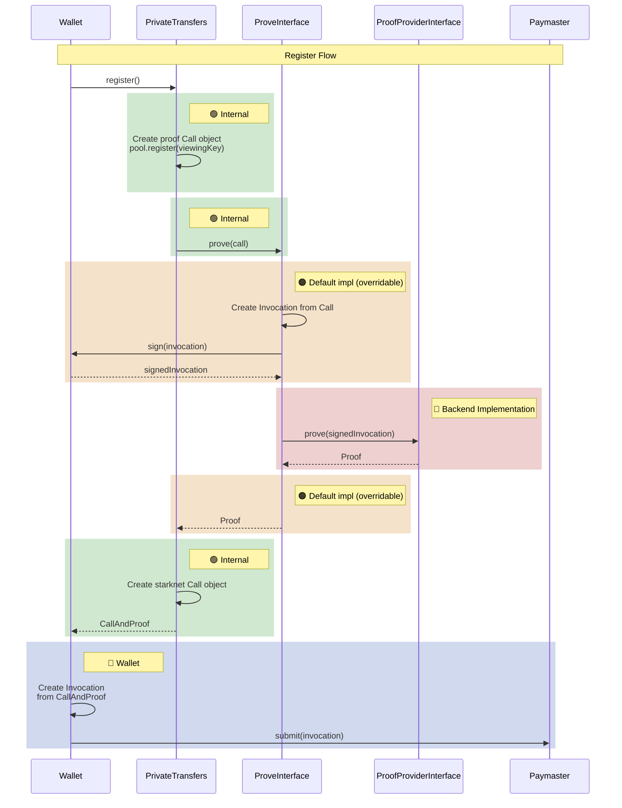
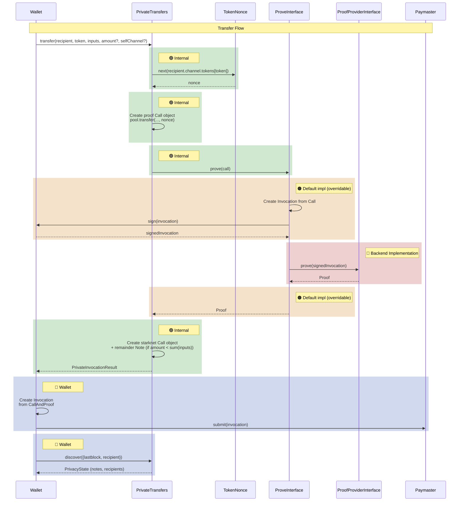

# Privacy SDK

TypeScript SDK for private transfers on Starknet.

## Architecture
The SDK abstracts away the interaction to create proofs returning Call and Proof objects to send to Starknet. 

The general flow is:
* Receive private parameters
* Create a private tx to prove
* Send to a backend server to prove
* Wait for the result, create a Call object matching the public part
* Return to the caller together with the Proof to send to Starknet

### Register Flow

### Transfer Flow

