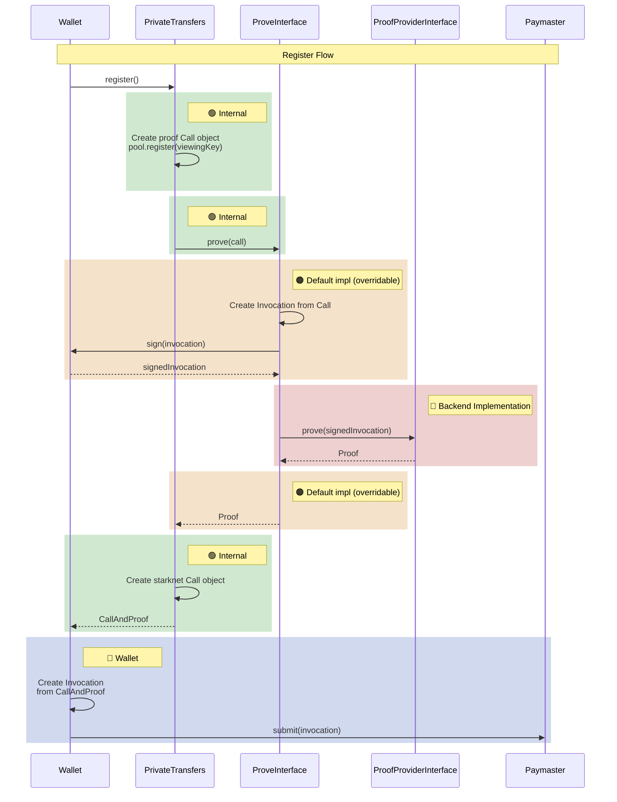
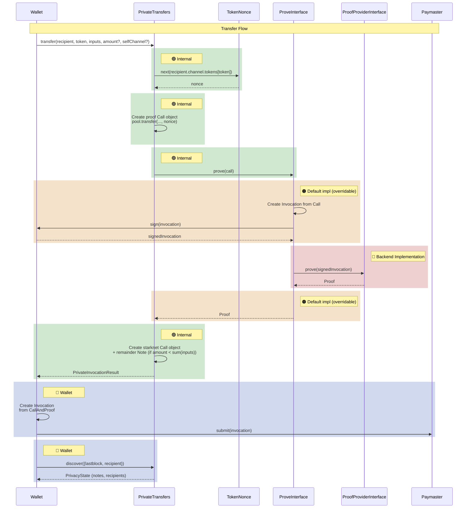

# Privacy SDK

TypeScript SDK for private transfers on Starknet.

## Installation

From a tagged release (GitHub npm registry):

```bash
npm install @starkware-libs/starknet-sdk
```

From a specific commit (git):

```bash
npm install "starkware-libs/starknet-privacy#<commit-sha>"
```

## Quick start

```typescript
import { Account, RpcProvider } from "starknet";
import { createPrivateTransfers, ContractDiscoveryProvider } from "starknet-sdk";

const provider = new RpcProvider({ nodeUrl: "http://localhost:5050" });
const account = new Account(provider, accountAddress, privateKey);

const transfers = createPrivateTransfers({
  account,
  viewingKeyProvider: { getViewingKey: () => viewingKey },
  provingProvider,
  discoveryProvider: new ContractDiscoveryProvider(poolContract),
  poolContractAddress,
});
```

## Configuration

### `createPrivateTransfers(params)`

| Parameter | Type | Description |
|-----------|------|-------------|
| `account` | `Account` | Starknet account for signing transactions |
| `viewingKeyProvider` | `ViewingKeyProvider` | Provides the private viewing key used for encryption/decryption |
| `provingProvider` | `ProofProviderInterface` | Backend that generates validity proofs |
| `discoveryProvider` | `DiscoveryProviderInterface` | Backend for discovering notes and channels |
| `poolContractAddress` | `StarknetAddress` | Address of the deployed privacy pool contract |
| `proofInvocationFactory?` | `ProofInvocationFactoryInterface` | Optional override for proof invocation construction |

### Discovery providers

**`ContractDiscoveryProvider`** — Queries the privacy pool contract directly via Starknet RPC. Best for development and testing.

```typescript
new ContractDiscoveryProvider(poolContract, { rateLimit?: { maxConcurrent, minDelay } });
```

**`IndexerDiscoveryProvider`** — Queries a discovery service via HTTP. Recommended for production; handles pagination and reorg detection.

```typescript
new IndexerDiscoveryProvider(apiUrl, contractAddress);
```

## Builder API

The builder provides a fluent interface for composing private operations. This is the recommended way to use the SDK.

### Register

```typescript
const result = await transfers.build()
  .register()
  .execute();
```

### Deposit

When depositing followed by other actions (transfers, withdrawals), omit the `recipient` on the deposit and use `surplusTo` to direct the remainder. This lets the SDK resolve all intermediate steps automatically.

```typescript
// Deposit to self (simple case)
const result = await transfers.build()
  .with(STRK, (t) => t.deposit({ amount: 100n }))
  .surplusTo(self)
  .execute();
```

### Deposit and transfer

```typescript
// Deposit 100, transfer 60 to bob — the SDK creates a 40 change note for self
const result = await transfers.build()
  .with(STRK, (t) => t
    .deposit({ amount: 100n })
    .transfer({ recipient: bob, amount: 60n }))
  .surplusTo(self)
  .execute();
```

### Transfer

```typescript
const result = await transfers.build()
  .with(STRK, (t) => t
    .inputs(note)
    .transfer({ recipient: bob, amount: 50n }))
  .execute();
```

### Withdraw

```typescript
const result = await transfers.build()
  .with(STRK, (t) => t
    .inputs(note)
    .withdraw({ amount: 30n }))
  .surplusTo(self)
  .execute();
```

### Multi-operation batch

```typescript
const result = await transfers.build()
  .with(STRK, (t) => t
    .inputs(note100Strk)
    .transfer({ recipient: alice, amount: 40n })
    .withdraw({ amount: 30n }))
  .surplusTo(self)
  .execute();
```

### Swap via invoke helper

```typescript
const result = await transfers.build()
  .with(STRK, (t) => t
    .inputs(strkNote)
    .withdraw({ recipient: swapHelper, amount: 10n }))
  .with(BTC, (t) => t
    .deposit({ amount: Open, depositor: swapHelper }))
  .call({ contractAddress: swapHelper, entrypoint: "swap", calldata: [...] })
  .execute();
```

## Execute options

Pass options to `build()` or `execute()` to control automation:

```typescript
const result = await transfers.build({
  autoRegister: true,
  autoSetup: true,
  autoSelectNotes: "naive",
  autoDiscover: { notes: "refresh", channels: "refresh" },
  registry: myRegistry,
}).with(STRK, (t) => t
  .transfer({ recipient: bob, amount: 50n }))
  .execute();
```

| Option | Type | Description |
|--------|------|-------------|
| `autoRegister` | `boolean` | Automatically register if user has no viewing key on-chain |
| `autoSetup` | `boolean` | Automatically open channels and token subchannels as needed |
| `autoSelectNotes` | `"all" \| "naive"` | Automatically select input notes (`"all"` uses every note, `"naive"` selects minimum) |
| `autoDiscover` | `{ notes?, channels? }` | Refresh notes/channels before executing (`"missing"`, `"refresh"`, or `"all"`) |
| `registry` | `PrivateRegistry` | User's private state (channels, notes, cursor) |
| `registryConst` | `boolean` | If true, returns a new registry instead of mutating the provided one |

## Discovery

### Check transfer readiness

```typescript
const requirement = await transfers.discoverRequirement(recipient, token);
// Returns: SetupRequirement.Register | SetupChannel | SetupToken | Ready
```

### Discover notes

```typescript
const { notes, timestamp } = await transfers.discoverNotes({
  tokens: [STRK],
  cursor: previousCursor,
});
// notes: AddressMap<Note[]> — unspent notes keyed by token address
```

### Discover channels

```typescript
const { channels, total } = await transfers.discoverChannels("all", {
  cursor: previousCursor,
});
// channels: AddressMap<Channel> — channels keyed by recipient address
```

## Execute result

Every `execute()` call returns:

```typescript
type ExecuteResult = {
  callAndProof: CallAndProof;  // Call + proof to send to the contract's execute_actions entry point
  registry: PrivateRegistry;   // Updated notes and recipient info
  warnings: Warning[];         // Privacy leakage warnings
};
```

The wallet sends `callAndProof` in a transaction to the contract's `execute_actions` entry point. The returned `registry` can be reused in subsequent calls once the transaction is accepted and enough blocks have passed to make the state verifiable.

## Key types

**`Note`** — A private UTXO with an amount, token, and cryptographic witness.

**`Channel`** — A communication channel to a recipient, holding a shared key and per-token nonces.

**`PrivateRegistry`** — The user's local state: discovered channels, unspent notes, and a pagination cursor. Create with `createEmptyRegistry()`.

**`AddressMap<V>`** — A `Map` that normalizes Starknet addresses for consistent key lookup.

## Testing

The SDK exports testing utilities from `starknet-sdk/testing`:

```typescript
import { Devnet, createDevnetTestEnv, MockPoolContract, MockProofProvider } from "starknet-sdk/testing";
```

Key exports: `Devnet`, `createDevnetTestEnv`, `MockPoolContract`, `MockProofProvider`, `ContractDiscoveryProvider`, `IndexerDiscoveryProvider`, and all hash functions for test verification.

## Internal flows

### Register flow



### Transfer flow



## Build

```bash
npm ci
npm run build
npm test
```
